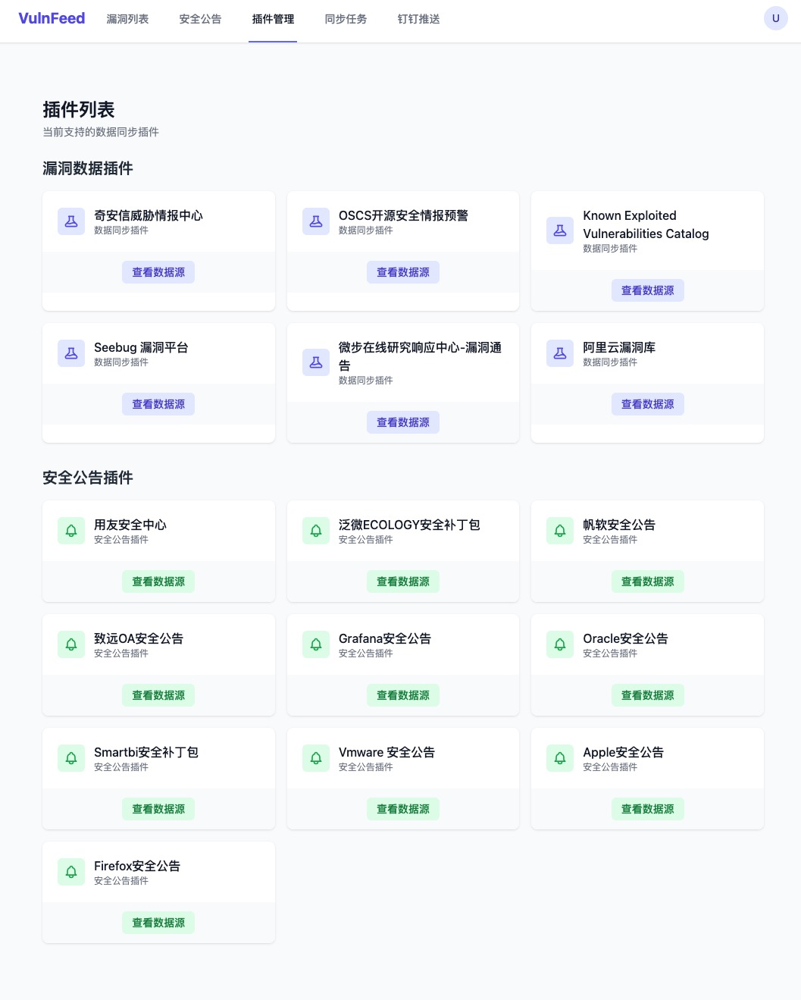

# VulnFeed 高价值漏洞、安全公告采集与推送

VulnFeed 是一个用于收集和推送高价值漏洞和补丁公告信息的工具。它从多个数据源抓取漏洞和公告信息，并通过钉钉机器人进行推送。

## 数据源

当前抓取漏洞来源的站点的数据:

| 名称                 | 地址                                                           | 推送策略                                                                     |
| -------------------- | -------------------------------------------------------------- | ---------------------------------------------------------------------------- |
| 阿里云漏洞库         | <https://avd.aliyun.com/high-risk/list>                        | 等级为高危或严重                                                             |
| OSCS开源安全情报预警 | <https://www.oscs1024.com/cm>                                  | 等级为高危或严重**并且**包含 `预警` 标签                                     |
| 知道创宇Seebug漏洞库 | <https://www.seebug.org/>                                      | 等级为高危或严重                                                             |
| CISA KEV             | <https://www.cisa.gov/known-exploited-vulnerabilities-catalog> | 全部推送                                                                     |
| 奇安信威胁情报中心   | <https://ti.qianxin.com/>                                      | 等级为高危严重**并且**包含 `奇安信CERT验证` `POC公开` `技术细节公布`标签之一 |
| 微步在线             | <https://x.threatbook.com/v5/vulIntelligence>                  | 等级为高危或严重                                                             |

当抓取安全补丁公告的站点数据：

| 名称                  | 地址                                                        | 推送策略                                           |
| --------------------- | ----------------------------------------------------------- | -------------------------------------------------- |
| 用友安全中心          | <https://security.yonyou.com/#/home>                        | 近三条数据                                         |
| 泛微ECOLOGY安全补丁包 | <https://www.weaver.com.cn/cs/securityDownload.html?src=cn> | "EC9.0全量补丁", "EC8.0全量补丁", "EC10.0安全补丁" |
| Smartbi安全补丁包     | <https://www.smartbi.com.cn/patchinfo>                      | 近三条数据                                         |
| 帆软安全漏洞声明      | <https://help.fanruan.com/finereport/doc-view-4833.html>    | 近三条数据                                         |





## Features

- [x] 支持多数据源采集
- [x] 支持定时任务
- [x] 支持钉钉推送
- [x] 支持根据 CVE 号在`github`上检索近一年的相关代码仓库链接
- [x] 支持根据 CVE 号在 `nuclei` PR 记录检索相关记录链接
- [x] 支持重安全软件安全补丁公告

## 本地开发

### 安装 sqlx-cli

```bash
cargo install --version='~0.8' sqlx-cli --no-default-features --features rustls,postgres
```

### 启动数据库

```bash
chmod a+x ./scripts/init_db.sh
./scripts/init_db.sh
```

### 后端服务

创建初始化管理员密码

```bash
cargo run --bin vulnfeed create-super-user -c ./dev/config.toml -p "密码"
```

```bash
cargo run --bin vulnfeed server -c ./dev/config.toml
```

### 前端服务

```bash
cd assets && pnpm install
pnpm dev
```

## 服务部署

项目已经写好了 `Dockerfile` 和 `docker-compose.yml`, 可以本地构建服务镜像，这里将前端代码打包到后端服务中，不需要单独的Nginx服务。

```bash
docker build -t vulnfeed:latest .
docker save -o vulnfeed.tar vulnfeed:latest
```

将构建好的镜像在服务器上导入。

```bash
docker load -i vulnfeed.tar
```

服务器创建部署目录：

```bash
mkdir /data/vulnfeed/config -p
```

将 `dev/config.toml` 配置文件拷贝到 `/data/vulnfeed/config`

将 `docker-compose.yml` 拷贝到 `/data/vulnfeed/`

```bash
docker-compose up -d
docker exec CONTAINER_NAME /app/vulnfeed create-super-user -c /app/vulnfeed/config.toml -p "密码"
```
